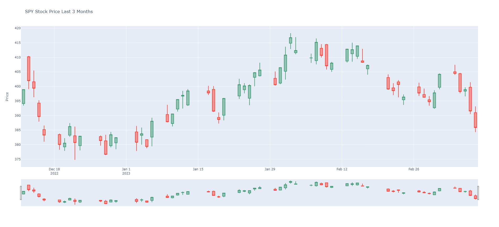

# Data Sets
Multiple datasets were utilized to generate bubble, funnel, and candlestick charts. In the case of the bubble chart, data related to car ownership was re-purposed to examine the correlation between years of experience and income, as well as credit score. This dataset proved to be particularly problematic due to numerous inconsistencies in how the information was collected and stored. As a result, several data cleansing functions were developed to mitigate these issues and ensure data standardization. The funnel chart data was sourced from Walmart's annual report, which provides an overview of revenue, expenses, gross profit, and net profit. Lastly, candlestick data for the SPY stock over the past few months was obtained from Yahoo Finance.

# Bubble Chart
As anticipated, the bubble chart demonstrates an overall inclination towards higher income, regardless of profession. Although some outliers exist, utilizing the zoom and filter tools from the plot tools could help to scrutinize this trend further. The most lucrative occupations were found to be doctors, lawyers, and other medical professionals.

# Funnel Chart
The funnel chart depicted in this figure presents some intriguing observations. Firstly, Walmart's net revenue is astounding, exceeding $600 billion annually. Additionally, it is noticeable that the cost of sales is substantial, resulting in a net profit of only $11 billion per year after all expenses. Without delving deeper, it remains unclear whether a portion of the cost of sales is allocated towards constructing new stores or investing in new technology. 

# CandleStick Chart
The chart was produced using Yahoo Finance data for the SPY stock over the past three months. Days in which the stock experienced a decline are represented in red, while days with an increase in value are depicted in green. Overall, the trend was relatively unremarkable, as the stock value remained relatively stable. However, it may be worthwhile to assess the alterations in price, volume, and other factors in the event of an imminent recession and compare them to other indices and stocks.

