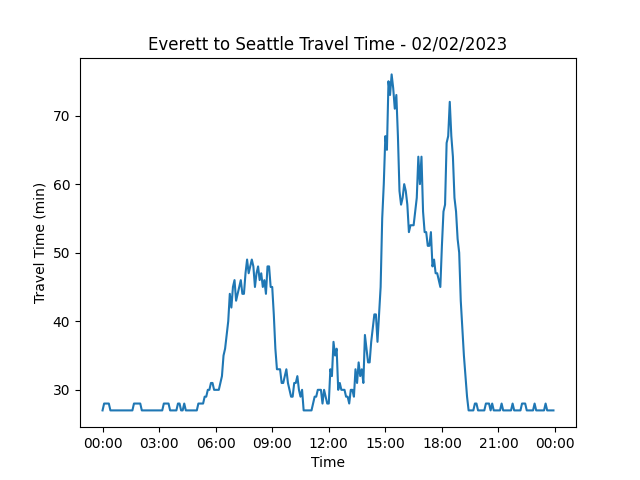
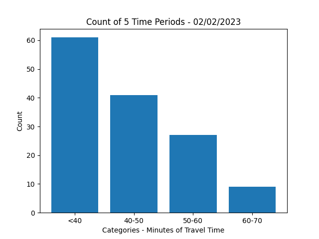
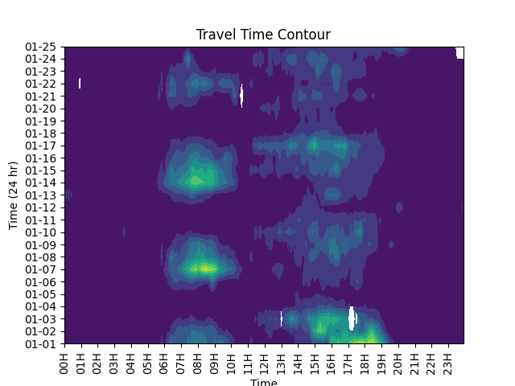
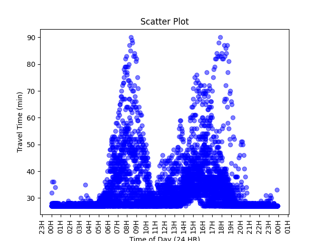

# Dataset
The data presented in the following plots is sourced from the Washington State Department of Transportation and shows the travel times between Everett and Seattle, Washington. This dataset utilizes in-pavement roadway sensors to calculate travel times, estimating start and stop destinations.

In my previous career as a traffic engineer, I frequently relied on this data to inform design decisions and facilitate discussions. If you're interested in accessing the dataset, it's available on the department's data portal [website](http://data.wsdot.wa.gov/traffic/nw).

# Line Chart
I have always found traffic patterns fascinating as they reflect cultural norms, work habits, and the effectiveness of transportation systems. The chart presented here clearly depicts the peak travel times between Everett and Seattle in Washington state. The travel times are calculated using in-pavement roadway sensors, and the start and stop destinations are estimated.

The chart shows that people experience travel times in excess of 40 minutes during peak commuting hours in the morning and afternoon. It is interesting to note that the afternoon travel times are longer than the morning ones, even though the morning peak travel direction is south. The reason for this may be attributed to several factors, including the change of direction of the reversible lanes, commuters traveling north for work and south for home, and backups from traffic leaving Seattle that affects the route far enough north.

# Bar Chart
This bar chart displays the classification or grouping of travel time data for a specific day. The categories were divided into <40, 40-45, 50-60, and 60-70+. As anticipated, the majority of the travel times fall under 40 minutes. However, it's crucial to note that this data is biased due to peak travel times. If the data were solely collected during these periods or working hours, the proportions on this bar chart would significantly shift, showing a higher percentage of longer travel times.

# Heatmap / Contour Plot
Contour plots are an effective way of visually representing multidimensional data in a concise and easily understandable manner. In this particular plot, the x-axis represents the time of day, while the y-axis represents the day. The color scale is used to indicate the travel time, with lighter colors indicating longer travel times. To interpret this chart, you can start from the bottom left and move to the right, following a particular day on the y-axis to see the travel time for different times of the day. For instance, on February 4, it appears that there was minimal traffic congestion throughout the day. In contrast, February 7 had higher levels of congestion from 7-10 AM and to some extent in the afternoon.

# Scatter Plot
The scatter plot of the data presents some preliminary patterns, but further analysis is needed to draw any meaningful conclusions. While one might expect correlation or regularity with traffic, such as a certain amount of time to complete a trip at a specific time of day, the data shows doesn't support this. There are some trends, like longer travel times during peak periods, but the data also reveals that trips can be completed with low travel times, even during peak hours. To fully explain the fluctuations in the data, a detailed analysis that takes into account accidents, holidays, travel behavior, construction projects, and special events would be necessary.

